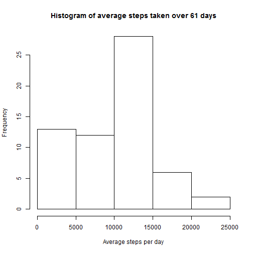
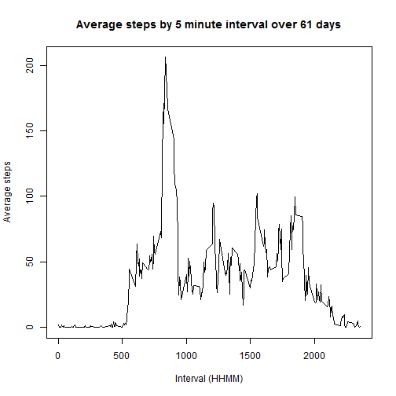
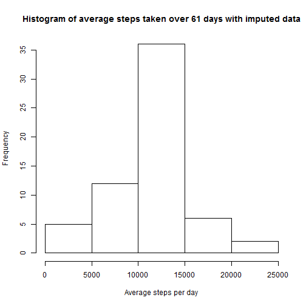
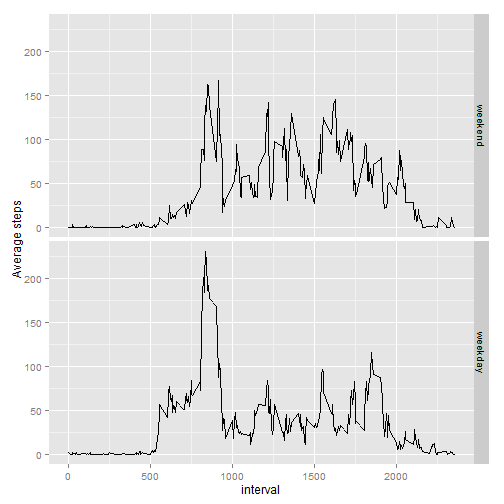

### Loading and preprocessing the data
The data set is imported from the R working directory, assuming it needs to be extracted. The extracted file titled 'activity.csv' is then imported. The package 'dplyr' is loaded for use throughout the script.

```r
unzip('activity.zip')
activity <- read.csv('activity.csv')
library("dplyr")
#Turn off scientific notation
options(scipen=999)
```

### What is mean total number of steps taken per day?
This section investigates the total number of steps per day. Initial calculations are done as follows:

```r
activityDaily <- group_by(activity, date)
dailySteps <- summarise(activityDaily, sumSteps = sum(steps, na.rm=T))
```

A histogram of total steps per day shows the distribution of daily steps.


```r
hist(dailySteps$sumSteps, xlab="Average steps per day", main="Histogram of average steps taken over 61 days")
```

 

The average number of steps per day is 9354.23 and the median is 10395

As calculated by:

```r
round(mean(dailySteps$sumSteps, na.rm=T),2)
median(dailySteps$sumSteps, na.rm=T)
```


### What is the average daily activity pattern?
This section investigates that average daily pattern of steps taken. Initial calculations are done as follows:

```r
activityInterval <- group_by(activity, interval)
intervalSteps <- summarise(activityInterval, meanSteps = mean(steps, na.rm=T))
```

The amount of steps taken throughout the day varies. This is shown on the following time series plot:

```r
plot(intervalSteps$meanSteps~intervalSteps$interval, type = "l", ylab="Average steps", xlab="Interval (HHMM)", main="Average steps by 5 minute interval over 61 days")
```

 

To identify the time/interval with the highest number of average steps, the relevant row number is extracted and then used to isolate the related interval.

```r
maxIntervalRow <- which.max(intervalSteps$meanSteps) 
```
The interval with the highest average number of steps is 835, where the two right hand side digits refer to minutes of the hour and the remaining digit(s) to the left relate to the hour of the day.

This has been derived as follows:

```r
intervalSteps$interval[maxIntervalRow]
```

### Imputing missing values
The number of missing values in this data set is 2304. As calculated by:

```r
sum(sapply(activity, function(x) sum(is.na(x))))
```

Missing data are imputed with the average number of steps for that interval. This is achieved as follows:

```r
activityImpute <- left_join(activity, intervalSteps, by="interval")
activityImpute <- mutate(activityImpute, imputedSteps= ifelse(is.na(steps)==T, meanSteps, steps))

activityImputeDaily <- group_by(activityImpute, date)
dailyImputeSteps <- summarise(activityImputeDaily, sumImputedSteps = sum(imputedSteps, na.rm=T))
```

The distribution of total daily steps taken with imputed data is:


```r
hist(dailyImputeSteps$sumImputedSteps, xlab="Average steps per day", main="Histogram of average steps taken over 61 days with imputed data")
```

 

The average number of steps per day, with imputed data is 10766.19 and the median is 10766.19

As calculated by:

```r
round(mean(dailyImputeSteps$sumImputedSteps, na.rm=T),2)
round(median(dailyImputeSteps$sumImputedSteps, na.rm=T),2)
```

### Are there differences in activity patterns between weekdays and weekends?
The differences in step pattern is investigated in this section. Observations are identified as either 'weekday' or 'weekend' and averaged by interval and day type. Results are then plotted to explore activity differences.


```r
weekdaysList <- c('Monday', 'Tuesday', 'Wednesday', 'Thursday', 'Friday')
activityImputeWeekday <- mutate(activityImpute, Weekdays= factor((weekdays(as.Date(date)) %in% weekdaysList)+1L, levels=1:2, labels=c('weekend', 'weekday')))

activityImputeIntervalWeekday <- group_by(activityImputeWeekday, interval, Weekdays)
intervalImputeStepsWeekday <- summarise(activityImputeIntervalWeekday, meanImputedSteps = mean(imputedSteps, na.rm=T))
```

Load the package 'ggplot2' and plot the number of steps by interval for weekends and weekdays.


```r
library('ggplot2')
```


```r
ggplot(intervalImputeStepsWeekday, aes(x=interval, y=meanImputedSteps)) + geom_line() +
   facet_grid(Weekdays ~ .) + ylab("Average steps")
```

 

The plot indicates that on average the individual is more active soon after 5am on a weekday than a weekend. Both day types have their highest level of activity in the morning. The patterns between the two day types do vary substantially.

